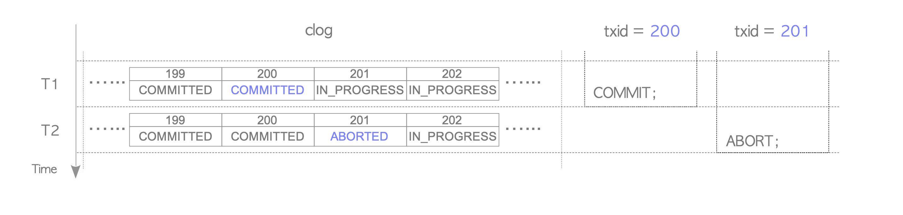

# PostgreSQL đảm bảo tính đơn nhất của các giao dịch dữ liệu như thế nào

PostgreSQL là một CSDL phổ biến với lịch sử phát triển hơn 30 năm, được tin dùng bởi rất nhiều lập trình viên và các công ty công nghệ trên thế giới. Một trong những tính năng nổi bật giúp cho PostgreSQL có được sự yêu thích và tin tưởng của cộng đồng IT toàn cầu là tính năng đảm bảo tính đơn nhất trong giao dịch của dữ liệu - Atomicity. Trong bài viết này chúng ta sẽ cùng tìm hiểu cách PostgreSQL đảm bảo tính atomicity để đảm bảo cho mọi giao dịch của hệ thống được diễn ra một cách đúng đắn và tin cậy.


## Tính đơn nhất của giao dịch dữ liệu - Transaction Atomicity là gì

Tính đơn nhất của giao dịch - Atomicity là một trong bốn tính chất quan trọng nhất mà một cơ sở dữ liệu quan hệ cần cung cấp cho hệ thống công nghệ thông tin. Một cơ sở dữ liệu đáp ứng tính chất Atomicity khi tất cả các thay đổi trong một giao dịch dữ liệu được đồng thời ghi lại vào database hoặc không thay đổi nào được ghi nhận khi lỗi xảy ra trong giao dịch, không xảy ra trạng thái một số thay đổi được ghi nhận còn một số thay đổi không được ghi nhận sau khi giao dịch dữ liệu hoàn thành. Tính chất Atomicity đảm bảo mọi giao dịch từ hệ thống đến cơ sở dữ liệu được diễn ra toàn vẹn, đảm bảo dữ liệu trong hệ thống luôn thay đổi theo các quy tắc định trước của hệ thống, không tạo ra các tình trạng dữ liệu trong hệ thống bị lộn xộn, mất kiểm soát. Một trong các ví dụ tiêu biểu nói lên tính cần thiết của Transaction là trong một giao dịch ngân hàng, hệ thống cần đảm bảo sau khi một giao dịch chuyển tiền từ tài khoản A sang tài khoản B diễn ra thành công thì sẽ chỉ xảy ra 2 trường hợp:

- Trường hợp 1: Giao dịch diễn ra thành công, tiền được trừ đi ở tài khoản A và cộng vào tài khoản B
- Trường hợp 2: Giao dịch thất bại, tiền ở tài khoản A và tài khoản B không thay đổi

Nếu không có tính Atomicity của cơ sở dữ liệu, sẽ có thể xảy ra tình trạng tiền ở tài khoản A đã được trừ nhưng tài khoản B lại chưa được cộng vào. Lúc này dữ liệu trong hệ thống sẽ ở trong tình trạng không kiểm soát và khiến cho thông tin ở trạng thái không còn đúng đắn.

## Giải pháp của PostgreSQL để đảm bảo tính đơn nhất của giao dịch dữ liệu

Là một cơ sở dữ liệu phục vụ cho các hệ thống công nghệ thông tin lớn cho nhiều người sử dụng đồng thời, PostgreSQL vừa phải đáp ứng khả năng cung cấp việc cung cấp dịch vụ cho nhiều người dùng đồng thời cùng 1 lúc, vừa cần đảm bảo tính đơn nhất cho mọi giao dịch mà lượng lớn người dùng này tạo ra trên cơ sở dữ liệu. Để đáp ứng 2 nhu cầu này, PostgreSQL sử dụng giải pháp tạo ra đồng thời nhiều bản sao của dữ liệu cho các transaction - Multi Version Concurrency Control (MVCC).

Với giải pháp MVCC,  khi một transaction bắt đầu, PostgreSQL thực hiện tạo ra một bản sao của trạng thái dữ liệu của dataabase cho transaction đó, được gọi là **snapshot**. Các thay đổi diễn ra trong transaction sẽ được diễn ra ở các bản snapshot độc lập với nhau, điều này cho phép nhiều transaction có thể hoạt động cùng 1 lúc với nhau trong database, thay đổi từ transaction này không ảnh hưởng và trộn vào thay đổi của transaction khác, đảm bảo không gây ra xung đột dữ liệu. Sau khi transaction hoàn tất và thực hiện commit vào database, thì toàn bộ các thay đổi trong transaction sẽ đi vào một hàng đợi và được ghi xuống database lần lượt bằng cách sử dụng global lock. Điều này đảm bảo rằng tại một thời điểm chỉ có một transaction được commit xuống database để đảm bảo tính toàn vẹn cho từng transaction.

Khi các snapshot được tạo ra và bị các transaction thay đổi dữ liệu, một row trong database được nhiều transaction thay đổi cùng 1 lúc sẽ được nhân bản thành nhiều version khác nhau, để đảm bảo tính độc lập của các transaction. Khi các transaction hoàn thành, tất cả mọi thay đổi liên quan đến row đó trong database sẽ được thực hiện và ghi lại kết quả cuối cùng vào row gốc trong database, và vì vậy các phiên bản khác của row đã được tạo ra trước đó sẽ trở nên thừa và không còn tác dụng, tuy nhiên các phiên bản này sẽ vẫn chiếm dụng dung lượng lưu trữ của database. Để xử lý vấn đề này, PostgreSQL sử dụng công cự dọn dẹp có tên là **vaccum process** có chức năng dọn dẹp các phiên bản của các row đã không còn được sử dụng bởi transaction nào nữa để giải phóng dung lượng lưu trữ của cơ sở dữ liệu.

Vậy PostgreSQL đã làm thế nào để tạo ra các snapshot cho các transaction, chúng ta sẽ đi vào chi tiết của quá trình tạo ra một snapshot cho một transaction mới.

## Giải pháp tạo ra snapshot cho một transaction của PostgreSQL

PostgreSQL định nghĩa một transaction như sau trong mã nguồn:

```c
typedef struct PGXACT
{
    TransactionId xid;   /* id of top-level transaction currently being
                          * executed by this proc, if running and XID
                          * is assigned; else InvalidTransactionId */

    TransactionId xmin;  /* minimal running XID as it was when we were
                          * starting our xact, excluding LAZY VACUUM:
                          * vacuum must not remove tuples deleted by
                          * xid >= xmin ! */

    ...
} PGXACT;
```

Trong thông tin của một transaction, PostgresSQL gán cho transaction một mã định danh `xid`, mã định danh này cho phép các tiến trình và các transaction khác của PostgreSQL nhận biết được transaction này và các thay đổi mà transaction này tạo ra. Để tối ưu hiệu năng hệ thống, một transaction chỉ được gán định danh khi nó bắt đầu thay đổi dữ liệu. Vì các tiến trình khác của PostgreSQL và các transaction khác chỉ quan tâm đến các dữ liệu bị thay đổi, nên các transaction không thay đổi dữ liệu - **read only transaction** không cần thông báo sự hiện diện của nó, vì vậy chúng sẽ không có định danh `xid`. 

Thông tin `xmin` của một transaction cho biết ID nhỏ nhất của các transaction đang hoạt động trên hệ thống khi transaction mới được khởi tạo. Vaccum process sử dụng thông tin này để đảm bảo nó không xoá nhầm các phiên bản của một row vẫn đang được sử dụng bởi một transaction đang hoạt động trong hệ thống, điều này giúp cho vaccum process hoạt động đúng đắn khi nó thực hiện dọn dẹp, trong lúc vẫn có các transaction khác đang đọc ghi dữ liệu trên hệ thống.

Thông tin về một snapshot của một transaction được PostgreSQL định nghĩa như sau:

```c
typedef struct SnapshotData
{
    /*
     * The remaining fields are used only for MVCC snapshots, and are normally
     * just zeroes in special snapshots.  (But xmin and xmax are used
     * specially by HeapTupleSatisfiesDirty.)
     *
     * An MVCC snapshot can never see the effects of XIDs >= xmax. It can see
     * the effects of all older XIDs except those listed in the snapshot. xmin
     * is stored as an optimization to avoid needing to search the XID arrays
     * for most tuples.
     */
    TransactionId xmin;            /* all XID < xmin are visible to me */
    TransactionId xmax;            /* all XID >= xmax are invisible to me */

    /*
     * For normal MVCC snapshot this contains the all xact IDs that are in
     * progress, unless the snapshot was taken during recovery in which case
     * it's empty. For historic MVCC snapshots, the meaning is inverted, i.e.
     * it contains *committed* transactions between xmin and xmax.
     *
     * note: all ids in xip[] satisfy xmin <= xip[i] < xmax
     */
    TransactionId *xip;
    uint32        xcnt; /* # of xact ids in xip[] */

    ...
}
```

Thông tin transactionID nhỏ nhất `xmin` của snaphsot được tính toán tương tự như với transaction. Các phiên bản row dữ liệu trong database nhỏ hơn `xmin` sẽ có mặt trọng trạng thái dữ liệu của snapshot. Ngoài ra, snapshot định nghĩa thêm thông tin `xmax`  có giá trị bằng giá trị ID của transaction mới nhất đã được commit vào cơ sở dữ liệu cộng thêm 1. Tất cả các phiên bản row có transaction id lớn hơn `xmax` sẽ không hiện diện trọng trạng thái dữ liệu của snapshot.

Ngoài ra, snapshot lưu lại thông tin các transaction đang hoạt động khi snapshot được tạo ra ở mảng `*xip` để theo dõi sự thay đổi dữ liệu của các transaction đang hoạt động này


Khi chúng ta bắt đầu một transaction mới bằng `BEGIN`, để tối ưu hiệu năng, PostgreSQL sẽ thực hiện:

- Không gán transactionID cho một transaction cho đến khi transaction đó thực hiện thay đổi dữ liệu
- Chỉ gán giá trị snapshot cho transaction khi transaction thực hiện query đầu tiên:

```c
static void
exec_simple_query(const char *query_string)
{
    ...

    /*
     * Set up a snapshot if parse analysis/planning will need one.
     */
    if (analyze_requires_snapshot(parsetree))
    {
        PushActiveSnapshot(GetTransactionSnapshot());
        snapshot_set = true;
    }

    ...
}
```

Cách thức snapshot tính toán các giá trị nó cần được thực hiện như sau:

Cách snapshot tính toán giá trị `xmax`:

```c
Snapshot
GetSnapshotData(Snapshot snapshot)
{
    /* xmax is always latestCompletedXid + 1 */
    xmax = ShmemVariableCache->latestCompletedXid;
    Assert(TransactionIdIsNormal(xmax));
    TransactionIdAdvance(xmax);

    ...

    snapshot->xmax = xmax;
}

#define InvalidTransactionId        ((TransactionId) 0)
#define BootstrapTransactionId      ((TransactionId) 1)
#define FrozenTransactionId         ((TransactionId) 2)
#define FirstNormalTransactionId    ((TransactionId) 3)

...

/* advance a transaction ID variable, handling wraparound correctly */
#define TransactionIdAdvance(dest)    \
    do { \
        (dest)++; \
        if ((dest) < FirstNormalTransactionId) \
            (dest) = FirstNormalTransactionId; \
    } while(0)

```

Cách snapshot tính toán giá trị `xmin` và mảng `*xip`:


```c
/*
 * Spin over procArray checking xid, xmin, and subxids.  The goal is
 * to gather all active xids, find the lowest xmin, and try to record
 * subxids.
 */
for (index = 0; index < numProcs; index++)
{
    volatile PGXACT *pgxact = &allPgXact[pgprocno];
    TransactionId xid;
    xid = pgxact->xmin; /* fetch just once */

    /*
     * If the transaction has no XID assigned, we can skip it; it
     * won't have sub-XIDs either.  If the XID is >= xmax, we can also
     * skip it; such transactions will be treated as running anyway
     * (and any sub-XIDs will also be >= xmax).
     */
    if (!TransactionIdIsNormal(xid)
        || !NormalTransactionIdPrecedes(xid, xmax))
        continue;

    if (NormalTransactionIdPrecedes(xid, xmin))
        xmin = xid;

    /* Add XID to snapshot. */
    snapshot->xip[count++] = xid;

    ...
}

...
```

## Quá trình PostgreSQL thực hiện commit một transaction

PostgreSQL thực hiện commit một transaction thông qua câu lệnh `CommitTransaction (in xact.c)`. Đây là một quá trình phức tạp, tuy nhiên các phần quan trọng của quá trình này là các bước sau:


```c
static void
CommitTransaction(void)
{
    ...

    /*
     * We need to mark our XIDs as committed in pg_xact.  This is where we
     * durably commit.
     */
    latestXid = RecordTransactionCommit();

    /*
     * Let others know about no transaction in progress by me. Note that this
     * must be done _before_ releasing locks we hold and _after_
     * RecordTransactionCommit.
     */
    ProcArrayEndTransaction(MyProc, latestXid);

    ...
}
```

PostgreSQL sẽ sử dụng câu lệnh này để đánh dấu transaction với ID này đã được commit vào database, đồng thời thông báo cho các transaction khác đang thực hiện rằng transaction này đã kết thúc.

Sau khi thực hiện xong hành động này, PostgreSQL ghi lại transaction đã được commit vào một danh sách được gọi là commit log. Danh sách này chính là danh sách các transaction đã được commit, là thông tin được sử dụng để snapshot xác định các tham số `xmin`, `xmax` và `*xip`. Đồng thời, commit log được sử dụng để tính toán ra trạng thái của một snapshot, tức là các dữ liệu và giá trị dữ liệu sẽ được snapshot trả về cho một câu query xuất hiện trong transaction được gán vào snapshot đó - `snapshot visibility`



## Snapshot visibility

Câu lệnh `heapgettup` được sử dụng để quét danh sách các version của các row sẽ được hiển thị cho một câu query của người dùng thông qua snapshot visibility:

```c
static void
heapgettup(HeapScanDesc scan,
           ScanDirection dir,
           int nkeys,
           ScanKey key)
{
    ...

    /*
     * advance the scan until we find a qualifying tuple or run out of stuff
     * to scan
     */
    lpp = PageGetItemId(dp, lineoff);
    for (;;)
    {
        /*
         * if current tuple qualifies, return it.
         */
        valid = HeapTupleSatisfiesVisibility(tuple,
                                             snapshot,
                                             scan->rs_cbuf);

        if (valid)
        {
            return;
        }

        ++lpp;            /* move forward in this page's ItemId array */
        ++lineoff;
    }

    ...
}

bool
HeapTupleSatisfiesMVCC(HeapTuple htup, Snapshot snapshot,
                       Buffer buffer)
{
    ...

    else if (XidInMVCCSnapshot(HeapTupleHeaderGetRawXmin(tuple), snapshot))
        return false;
    else if (TransactionIdDidCommit(HeapTupleHeaderGetRawXmin(tuple)))
        SetHintBits(tuple, buffer, HEAP_XMIN_COMMITTED,
                    HeapTupleHeaderGetRawXmin(tuple));

    ...

    /* xmax transaction committed */

    return false;
}
```

Mỗi một version của một row dữ liệu sẽ được gắn với transaction đã tạo ra row version đó thông qua trường `xid`. `XidInMVCCSnapshot` sẽ thực hiện check `xid` của row dữ liệu có thoả mãn các tham số `xmin`, `xmax` và `*xip` hay không. 

```c
static bool
XidInMVCCSnapshot(TransactionId xid, Snapshot snapshot)
{
    /* Any xid < xmin is not in-progress */
    if (TransactionIdPrecedes(xid, snapshot->xmin))
        return false;
    /* Any xid >= xmax is in-progress */
    if (TransactionIdFollowsOrEquals(xid, snapshot->xmax))
        return true;

    ...

    for (i = 0; i < snapshot->xcnt; i++)
    {
        if (TransactionIdEquals(xid, snapshot->xip[i]))
            return true;
    }

    ...
}
```

Giá trị trả về `false` tức là row này trong phạm vi xử lý của snapshot, nếu trả về `true` thì row này nằm ngoài phạm vi xử lý của snapshot và sẽ không được hiển thị cho người dùng. Sau bước này, Postgres tiếp tục kiểm tra xem giá trị `xid` của row dữ liệu đã được commit hay chưa:

```c
bool /* true if given transaction committed */
TransactionIdDidCommit(TransactionId transactionId)
{
    XidStatus xidstatus;

    xidstatus = TransactionLogFetch(transactionId);

    /*
     * If it's marked committed, it's committed.
     */
    if (xidstatus == TRANSACTION_STATUS_COMMITTED)
        return true;

    ...
}
```

Nếu transaction này đã được commit, tức là row này này có trong `snapshot visible`, nếu chưa được commit thì row này không có trong `snapshot visible` trả về cho query của transaction. Việc check xem transaction đã được commit hay chưa sẽ được kiểm tra thông qua danh sách transaction đã được commit của commit log.

Tuy nhiên việc thực hiện `TransactionIdDidCommit` mỗi lần query trả về dữ liệu cho người dùng là một thao tác tốn kém, vì phải thực hiện duyệt lại commit log liên tục. Vì vậy để giảm bớt số lần phải duyệt danh sách commit log, PostgresSQL đánh dấu các row đã được kiểm tra thông qua `hint bit`

```c
SetHintBits(tuple, buffer, HEAP_XMIN_COMMITTED,
            HeapTupleHeaderGetRawXmin(tuple));
```

Các row đã được đánh dấu hintbit sẽ không cần thực hiện quét lại danh sách commit log mỗi lần xây dựng `snapshot visibility` nữa.

## Tài liệu tham khảo

- https://brandur.org/postgres-atomicity
- https://malisper.me/the-postgres-commit-log/
- https://www.interdb.jp/pg/pgsql05.html